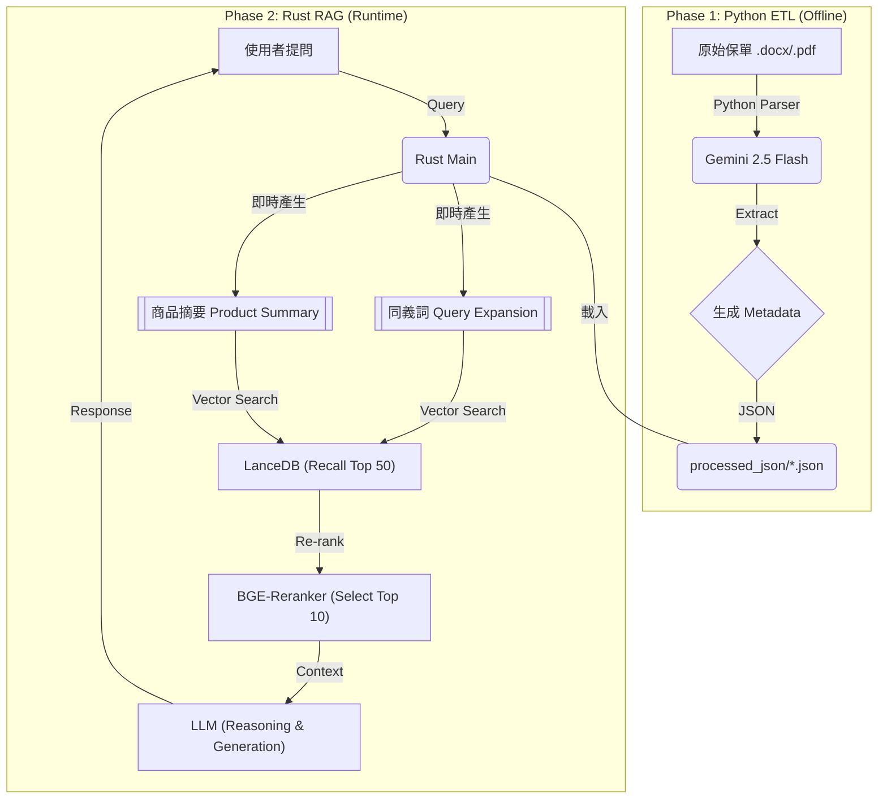

# 🛡️ AI Insurance Consultant RAG (Rust + Python + LanceDB)

> **Project: An Old Soldier's Digital Legacy**
>
> 這是一個基於 **Rust** (高效能服務) 與 **Python** (智慧資料處理) 的混合式 RAG (Retrieval-Augmented Generation) 系統。旨在解決保險商品條款複雜、術語艱澀的檢索難題，提供具備「核保邏輯」與「顧問思維」的 AI 諮詢服務。

## 🌟 專案亮點 (Key Features)

本專案不同於一般的 RAG Demo，它針對金融保險領域的 **「高正確性」** 與 **「合規性」** 需求進行了深度優化：

* **⚡ 混合式架構 (Hybrid Architecture)**
    * **Python ETL (Offline)**：利用 Google Gemini 強大的理解力，將非結構化文件 (PDF/DOCX) 轉化為結構化 JSON，自動提取「適用客群」、「同義詞 (Client Slangs)」與「商品摘要」。
    * **Rust Serving (Online)**：利用 Rust 的記憶體安全性與高效能，處理向量檢索、Re-ranking 與 API 服務。

* **🎯 漏斗式精準檢索 (The Precision Funnel)**
    * **Recall (廣度)**：先撈取 Top 50 筆候選資料，確保不遺漏冷門商品。
    * **Re-ranking (準度)**：使用 Cross-Encoder (BGE-Reranker) 進行語意重排序，精選 Top 10。
    * **Reasoning (邏輯)**：透過 LLM 的閱讀理解能力，剔除不相關的雜訊 (例如商業火險)，並進行核保邏輯過濾。

* **🧠 語意增強與同義詞注入**
    * 解決「死掉賠錢」搜不到「身故保險金」的問題。在 ETL 階段自動建立同義詞庫 (Synonym Mapping)，並在檢索時動態擴充 Query。

* **🛡️ 合規與顧問思維**
    * 系統 Prompt 內建「雙十原則」財務規劃邏輯。
    * 具備基礎「核保過濾」能力（如年齡檢核）。
    * 嚴格的 **Zero Hallucination** 政策：資料不足時誠實告知，不捏造保單內容。

## 🏗️ 系統架構 (Architecture)



## 🛠️ 技術棧 (Tech Stack)
* **Core Logic:** Rust (Tokio, Serde, reqwest)

* **ETL Scripting:** Python 3.10+ (Pydantic, Google GenAI SDK, python-docx)

* **Vector Database:** LanceDB (Embedded, Serverless)

* **Embeddings:** BGE-Base-zh-v1.5 (via fastembed-rs)

* **Re-ranker:** BGE-Reranker-v2-m3 (Python API / Local)

* **LLM Service:** Google Gemini (ETL), Local LLM / OpenAI Compatible API (Serving)

## 📂 目錄結構

```
.
├── Cargo.toml              # Rust 專案設定
├── data/
│   ├── raw_docx/           # [Input] 原始 Word 保單
│   ├── processed_json/     # [Output] ETL 產出的結構化資料
│   ├── system_prompt.txt   # [Config] AI 顧問的核心指令集
│   └── lancedb_insure/     # [DB] 向量資料庫檔案
├── pysrc/
│   ├── etl_docx_to_json.py # 核心 ETL 程式 (含同義詞與客群標籤生成)
│   └── rerank_server.py    # (Optional) Re-ranker API Server
├── src/
│   ├── main.rs             # Rust 主程式 (RAG Pipeline)
│   └── models.rs           # 資料結構定義
└── .env                    # 環境變數 (API Keys)
```
## 🚀 快速開始 (Quick Start)
### 1. 環境準備
請確保已安裝 Rust 工具鏈與 Python 3。

```Bash
# 設定環境變數
cp .env.example .env
# 填入 GOOGLE_API_KEY, VLLM_ENDPOINT 等資訊
```
### 2. 資料前處理 (ETL)
將保單文件放入 `data/raw_docx/`，執行 Python 腳本進行智慧解析。

```Bash
pip install -r requirements.txt
python pysrc/etl_docx_to_json.py
```
### 3. 啟動 RAG 服務
Rust 程式會自動掃描 JSON 檔，建立索引與向量資料庫，並進入 CLI 問答模式。
```Bash
cargo run --release
```
## 🧠 核心邏輯解析 (Under the Hood)
### 1. 語意切片與標籤注入 (Semantic Chunking with Metadata)
我們不只切分文字，還將 ETL 階段分析出的「客群標籤」埋入每個 Chunk 的 Header。

```
[適用客群: 兒童/新生兒, 三明治族] [關鍵字: 小孩保險, 寶寶保單]
商品: 旺旺保2.1專案 | 內容: ...
```

這使得當用戶搜尋「幫剛出生的兒子買保險」時，即使內文沒有「兒子」二字，也能透過標籤強烈命中。

### 2. 系統提示詞工程 (System Prompt Engineering)
位於 data/system_prompt.txt，我們定義了 AI 的行為邊界：

* **核保邏輯：** 檢查年齡是否符合。

* **財務建議：** 若無具體數據，依據「雙十原則」提供建議。

* **誠實原則：** 拒絕回答資料庫中不存在的資訊。

## 📝 Future Roadmap (V2)
* **[ ] 結構化核保篩選：** 在 JSON 中加入 min_age, max_age 等數值欄位，在向量檢索前進行 Pre-filtering。

* **[ ] 多輪對話 (Multi-turn)：** 加入對話歷史記憶，支援追問。

* **[ ] Web UI：** 使用 Axum + React 構建前端介面。
---
**Author:** Jack Chou (Retiring 2028) License: MIT

**README Produced by:** Gemini 3 Pro