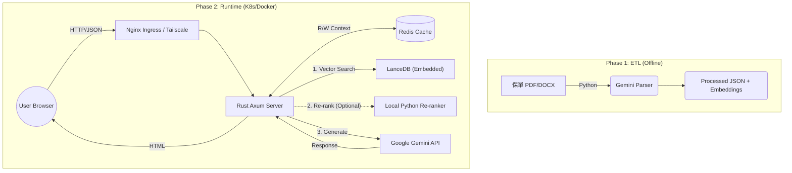

# 🛡️ AI Insurance Consultant RAG


>**Project: Senior Architect's Capstone**
>
> This project demonstrates a production-ready, hybrid RAG (Retrieval-Augmented Generation) architecture built with **Rust (Axum)** and **Python**. It addresses the challenge of retrieving complex insurance policies with high precision and compliance.
>
> Designed by a veteran engineer, this system bridges the gap between modern AI capabilities (LLMs) and rigorous software engineering standards (Rust/K8s).
>
> 這是一個基於 **Rust (Axum)** 與 **Python** 的混合式 RAG (Retrieval-Augmented Generation) 系統。旨在解決保險商品條款複雜、術語艱澀的檢索難題，提供具備「核保邏輯」與「顧問思維」的 AI 諮詢服務。
>
> **目前狀態：v2.0 Stable (Web UI + Kubernetes Deployment)**
> 
> **支援模式：Web 介面(Standalone/Containerized/K8Sized) / CLI 終端機**

## 🌟 專案亮點 (Key Features)

本專案針對金融保險領域的 **「高正確性」** 與 **「合規性」** 需求進行了深度優化：

* **⚡ 混合式架構 (Hybrid Architecture)**
    * **Cloud Brain (Gemini)**：利用 Google Gemini 強大的理解力，將非結構化文件 (PDF/DOCX) 轉化為結構化 JSON。
    * **Edge Computing (Rust + Local AI)**：利用 Axum 框架提供高效能 Web 服務，整合向量檢索、Re-ranking 與 Redis 對話記憶。

* **🎯 漏斗式精準檢索 (The Precision Funnel)**
    * **Recall (廣度)**：LanceDB 撈取 Top 50 筆候選資料。
    * **Re-ranking (準度)**：使用 Cross-Encoder (BGE-Reranker) 進行語意重排序，精選 Top 10。
    * **Reasoning (邏輯)**：透過 LLM (Google Gemini) 剔除雜訊並進行核保邏輯過濾。

* **🧠 多輪對話與記憶 (Context Awareness)**
    * 整合 **Redis** 儲存 Session Context，讓 AI 能記得使用者的上一句話（如：「那保費多少？」）。
    * 前端與後端分離設計，支援 Session 恢復。

* **🛡️ 企業級資安與部署**
    * **WAF Bypass 策略**：前端 Payload 優化，通過嚴格的 ModSecurity 規則。
    * **Zero Trust Network**：整合 **Tailscale Sidecar**，支援透過內網 VPN 直連，繞過公網暴露風險。
    * **GitOps**：支援 ArgoCD 自動化部署至 Kubernetes (OKE)。

## 🏗️ 系統架構 (Architecture)



## 🧠 選用模組：本地重排序服務 (Local Rerank Service)
為了在不依賴外部 API 的情況下提升檢索精確度，本專案包含一個獨立的 Python Re-ranking 微服務。

* **模型**：BAAI/bge-reranker-v2-m3

* **特色**：

    * **硬體加速**：自動偵測並使用 Apple Silicon (MPS)、NVIDIA CUDA 或 CPU。

    * **記憶體優化**：針對 Mac M1/M2 進行 FP16 半精度優化與主動垃圾回收 (GC)，可以運用在只有 16GB RAM 設備上。

    * **降級機制**：若未啟動此服務，Rust 主程式會自動降級為標準向量檢索，確保系統不中斷。

## 🛠️ 技術棧 (Tech Stack)
* **Core Backend**: Rust (Axum, Tokio, Serde, reqwest)

* **Frontend**: Vanilla JS + TailwindCSS (No build step required)

* **ETL Pipeline**: Python 3.10+ (Pydantic, Google GenAI SDK, python-docx)

* **Database**: LanceDB (Vector), Redis (Session Store, History Cache)

* **AI Models**: 
    * Embedding: BGE-Base-zh-v1.5 (via fastembed-rs)

    * Re-ranker: BGE-Reranker-v2-m3 (Python API / Local)

    * LLM: Google Gemini 2.5+ Flash, Local LLM / OpenAI Compatible API

* **Infrastructure**: Docker, Kubernetes (OKE), ArgoCD, Tailscale


## 📂 目錄結構

```
.
├── Cargo.toml              # Rust 專案設定
├── data/
│   ├── raw_pdfs/           # [Input] 原始 PDF 保單
│   ├── raw_docx/           # [Input] 原始 Word 保單
│   ├── processed_json/     # [Output] ETL 產出的結構化資料
│   ├── system_prompt.txt   # [Config] AI 顧問的核心指令集
│   └── lancedb_insure/     # [DB] 向量資料庫檔案
├── pysrc/
│   ├── etl_docx_to_json.py # 核心 ETL 程式 
│   ├── etl_pdf_to_json.py  # 核心 ETL 程式 
│   └── rerank_server.py    # Re-ranker API Server
├── src/
│   ├── bin/
│   │   ├── cli.rs          # CLI Entrypoint
│   │   └── web.rs          # Web service (AXUM)
│   ├── lib.rs              # Rust 主程序 (RAG Pipeline)
│   └── models.rs           # 資料結構定義
├── frontend/               # [Web] 靜態網頁檔案
│   └── index.html
├── k8s-reference/          # [Ref] K8s 部署範本 (僅供參考，正式部署走 GitOps)
│   ├── deployment.yaml
│   ├── service.yaml
│   └── ingress.yaml
├── .env                    # 環境變數 (API Keys)
├── .gitlab-ci.yml          # Gitlab CI Pipeline
├── .docker-compose.yml     # docker compose file for local docker
├── entrypoint.sh           # user/permission fix on docker
└── Dockerfile              # docker build file

```
## 🚀 快速開始 (Quick Start)
### 1. 環境準備
請確保已安裝 Rust 工具鏈、Python 3 與 Docker。

```Bash
# 設定環境變數
cp .env.example .env
# 填入 GOOGLE_API_KEY, VLLM_ENDPOINT 等資訊
```
### 2. 資料前處理 (ETL)
將保單文件放入 `data/raw_docx/`，執行 Python 腳本進行智慧解析。

```Bash
pip install -r requirements.txt
python pysrc/etl_docx_to_json.py
```
### 3. 啟動 RAG 服務
Rust 程式會自動掃描 JSON 檔，建立索引與向量資料庫
* 進入 CLI 問答模式。
    ```Bash
    # 1. 啟動 Re-ranker (Optional, 建議開啟以獲得最佳效果)
    python pysrc/rerank_server.py &
    # 2. 啟動主程式
    cargo run --bin cli
    ```
* 進入 Web Service
    ```Bash
    # 1. 啟動 Re-ranker (Optional, 建議開啟以獲得最佳效果)
    python pysrc/rerank_server.py &
    # 2. 啟動主程式
    cargo run --bin web
    # Server running at http://localhost:8080
    ```
* 本地端 Docker (含Redis)
    ```Bash
    docker compose up --build
    ```
* K8S 部署

    * 本專案採用 GitOps 架構，正式 Manifests 託管於外部 CD Repo。
    * 若需手動部署或重建環境，可參考 k8s-reference/ 目錄下的 YAML 範本。

## 🧠 核心邏輯解析 (Key Logic)
### 1. 語意切片與標籤注入 (Semantic Chunking with Metadata)
我們不只切分文字，還將 ETL 階段分析出的「客群標籤」埋入每個 Chunk 的 Header。

```
[適用客群: 兒童/新生兒, 三明治族] [關鍵字: 小孩保險, 寶寶保單]
商品: 旺旺保2.1專案 | 內容: ...
```

這使得當用戶搜尋「幫剛出生的兒子買保險」時，即使內文沒有「兒子」二字，也能透過標籤強烈命中。

### 2. 系統提示詞工程 (System Prompt Engineering)
位於 data/system_prompt.txt，我們定義了 AI 的行為邊界：

* **核保邏輯：** 檢查年齡是否符合。

* **財務建議：** 若無具體數據，依據「雙十原則」提供建議。

* **誠實原則：** 拒絕回答資料庫中不存在的資訊。

## 📝 Roadmap & Changelog
* **[X] 結構化核保篩選：** 在 JSON 中加入 min_age, max_age 等數值欄位，在向量檢索前進行 Pre-filtering。(V1)

* **[X] Web UI 介面** (V2 - Axum + Tailwind)

* **[X] 多輪對話 (Multi-turn/Redis)：** 加入對話歷史記憶，支援追問。(V2)

* **[X] Kubernetes 部署** (V2 - Helm/Manifests)。

* **[ ] 語音輸入/輸出** (Future)
---
**Author:** Jack Chou (Retiring 2028) License: MIT

**README Produced by:** Gemini 3 Pro