# 🛡️ AI Insurance Consultant RAG (Web Edition)

> **Project: An Old Soldier's Digital Legacy**
>
> 這是一個基於 **Rust (Axum)** 與 **Python** 的混合式 RAG (Retrieval-Augmented Generation) 系統。旨在解決保險商品條款複雜、術語艱澀的檢索難題，提供具備「核保邏輯」與「顧問思維」的 AI 諮詢服務。
>
> **目前狀態：v2.0 Stable (Web UI + Kubernetes Deployment)**

## 🌟 專案亮點 (Key Features)

本專案針對金融保險領域的 **「高正確性」** 與 **「合規性」** 需求進行了深度優化：

* **⚡ 混合式架構 (Hybrid Architecture)**
    * **Python ETL (Offline)**：利用 Google Gemini 強大的理解力，將非結構化文件 (PDF/DOCX) 轉化為結構化 JSON。
    * **Rust Serving (Online)**：利用 Axum 框架提供高效能 Web 服務，整合向量檢索、Re-ranking 與 Redis 對話記憶。

* **🎯 漏斗式精準檢索 (The Precision Funnel)**
    * **Recall (廣度)**：LanceDB 撈取 Top 50 筆候選資料。
    * **Re-ranking (準度)**：使用 Cross-Encoder (BGE-Reranker) 進行語意重排序，精選 Top 10。
    * **Reasoning (邏輯)**：透過 LLM (Google Gemini) 剔除雜訊並進行核保邏輯過濾。

* **🧠 多輪對話與記憶 (Context Awareness)**
    * 整合 **Redis** 儲存 Session Context，讓 AI 能記得使用者的上一句話（如：「那保費多少？」）。
    * 前端與後端分離設計，支援 Session 恢復。

* **🛡️ 企業級資安與部署**
    * **WAF Bypass 策略**：前端 Payload 優化，通過嚴格的 ModSecurity 規則。
    * **Zero Trust Network**：整合 **Tailscale Sidecar**，支援透過內網 VPN 直連，繞過公網暴露風險。
    * **GitOps**：支援 ArgoCD 自動化部署至 Kubernetes (OKE)。

## 🏗️ 系統架構 (Architecture)

```mermaid
graph TD
    subgraph "Phase 1: ETL (Offline)"
        A["保單 PDF/DOCX"] -->|Python| B("Gemini Parser")
        B --> F("Processed JSON + Embeddings")
    end

    subgraph "Phase 2: Runtime (K8s/Docker)"
        User((User Browser)) -->|HTTP/JSON| LB["Nginx Ingress / Tailscale"]
        LB --> Web["Rust Axum Server"]
        
        Web <---|載入| F
        Web <-->|R/W History| Redis[("Redis Cache")]
        
        Web -->|1. Vector Search| Lance["LanceDB (Embedded)"]
        Web -->|2. Re-rank| Rerank["BGE-Reranker API"]
        Web -->|3. Generate| Gemini["Google Gemini API"]
        
        Gemini -->|Response| Web
        Web -->|HTML/JSON| User
    end
```



## 🛠️ 技術棧 (Tech Stack)
* **Backend**: Rust (Axum, Tokio, Serde, reqwest)

* **Frontend**: Vanilla JS + TailwindCSS (No build step required)

* **ETL Scripting**: Python 3.10+ (Pydantic, Google GenAI SDK, python-docx)

* **Database**: LanceDB (Vector), Redis (Session Store, History Cache)

* **AI Models**: 
    * Embedding: BGE-Base-zh-v1.5 (via fastembed-rs)

    * Re-ranker: BGE-Reranker-v2-m3 (Python API / Local)

    * LLM: Google Gemini 2.5+ Flash, Local LLM / OpenAI Compatible API

* **Infra**: Docker, Kubernetes (OKE), ArgoCD, Tailscale


## 📂 目錄結構

```
.
├── Cargo.toml              # Rust 專案設定
├── data/
│   ├── raw_pdfs/           # [Input] 原始 PDF 保單
│   ├── raw_docx/           # [Input] 原始 Word 保單
│   ├── processed_json/     # [Output] ETL 產出的結構化資料
│   ├── system_prompt.txt   # [Config] AI 顧問的核心指令集
│   └── lancedb_insure/     # [DB] 向量資料庫檔案
├── pysrc/
│   ├── etl_docx_to_json.py # 核心 ETL 程式 
│   ├── etl_pdf_to_json.py  # 核心 ETL 程式 
│   └── rerank_server.py    # Re-ranker API Server
├── src/
│   ├── bin/
│   │   ├── cli.rs          # CLI Entrypoint
│   │   └── web.rs          # Web service (AXUM)
│   ├── lib.rs              # Rust 主程序 (RAG Pipeline)
│   └── models.rs           # 資料結構定義
├── .env                    # 環境變數 (API Keys)
├── .gitlab-ci.yml          # Gitlab CI Pipeline
├── .docker-compose.yml     # docker compose file for local docker
├── entrypoint.sh           # user/permission fix on docker
└── Dockerfile              # docker build file

```
## 🚀 快速開始 (Quick Start)
### 1. 環境準備
請確保已安裝 Rust 工具鏈與 Python 3。

```Bash
# 設定環境變數
cp .env.example .env
# 填入 GOOGLE_API_KEY, VLLM_ENDPOINT 等資訊
```
### 2. 資料前處理 (ETL)
將保單文件放入 `data/raw_docx/`，執行 Python 腳本進行智慧解析。

```Bash
pip install -r requirements.txt
python pysrc/etl_docx_to_json.py
```
### 3. 啟動 RAG 服務
Rust 程式會自動掃描 JSON 檔，建立索引與向量資料庫
* 進入 CLI 問答模式。
    ```Bash
    cargo run --bin cli
    ```
* 進入 Web Service
    ```Bash
    cargo run --bin web
    ```
* 本地端 Docker (含Redis)
    ```Bash
    docker-compose up --build
    ```
* K8S 部署 - 請自行參考 `.gitlab-ci.yml`

## 🧠 核心邏輯解析 (Under the Hood)
### 1. 語意切片與標籤注入 (Semantic Chunking with Metadata)
我們不只切分文字，還將 ETL 階段分析出的「客群標籤」埋入每個 Chunk 的 Header。

```
[適用客群: 兒童/新生兒, 三明治族] [關鍵字: 小孩保險, 寶寶保單]
商品: 旺旺保2.1專案 | 內容: ...
```

這使得當用戶搜尋「幫剛出生的兒子買保險」時，即使內文沒有「兒子」二字，也能透過標籤強烈命中。

### 2. 系統提示詞工程 (System Prompt Engineering)
位於 data/system_prompt.txt，我們定義了 AI 的行為邊界：

* **核保邏輯：** 檢查年齡是否符合。

* **財務建議：** 若無具體數據，依據「雙十原則」提供建議。

* **誠實原則：** 拒絕回答資料庫中不存在的資訊。

## 📝 Roadmap & Changelog
* **[X] 結構化核保篩選：** 在 JSON 中加入 min_age, max_age 等數值欄位，在向量檢索前進行 Pre-filtering。(V1)

* **[X] Web UI 介面** (V2 - Axum + Tailwind)

* **[X] 多輪對話 (Multi-turn/Redis)：** 加入對話歷史記憶，支援追問。(V2)

* **[X] Kubernetes 部署** (V2 - Helm/Manifests)。

* **[ ] 語音輸入/輸出** (Future)
---
**Author:** Jack Chou (Retiring 2028) License: MIT

**README Produced by:** Gemini 3 Pro